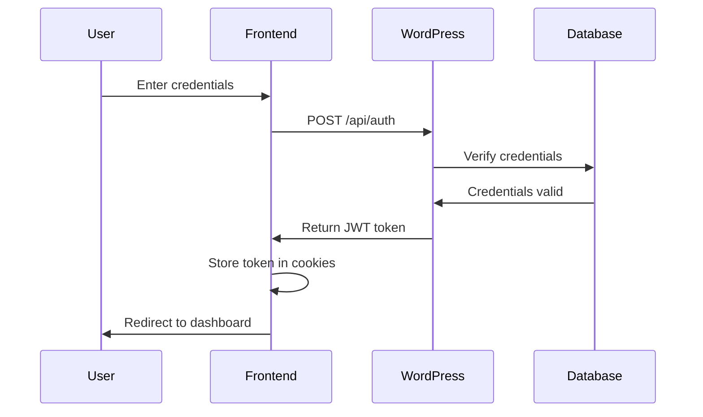

# TributeStream Authentication & Security Guide

## Overview

This document details the authentication system and security measures implemented in TributeStream, covering both the SvelteKit frontend and WordPress backend integration.

## Authentication Flow

### 1. Login Process



### 2. JWT Implementation

1. **Token Generation**
   - Generated by WordPress JWT plugin
   - Contains user ID and role
   - Includes expiration time

2. **Token Storage**
   - Stored in HTTP-only cookies
   - Secured with same-site attribute
   - Automatically included in API requests

3. **Token Validation**
   ```typescript
   // Example token validation in hooks.server.ts
   export const handle = async ({ event, resolve }) => {
     const token = event.cookies.get('jwt');
     if (token) {
       // Validate token and set user in locals
       event.locals.user = validateToken(token);
     }
     return resolve(event);
   };
   ```

### 3. Protected Routes

1. **Server-Side Protection**
   ```typescript
   // Example protected route
   export const load = async ({ locals }) => {
     if (!locals.user) {
       throw redirect(302, '/login');
     }
     return {
       user: locals.user
     };
   };
   ```

2. **Client-Side Protection**
   - Navigation guards in layout components
   - Role-based access control
   - Protected API endpoints

## Security Measures

### 1. Frontend Security

1. **CSRF Protection**
   - SvelteKit's built-in CSRF protection
   - Form actions validation
   - Token validation

2. **XSS Prevention**
   - Content sanitization
   - Proper HTML escaping
   - CSP headers

3. **Cookie Security**
   ```typescript
   // Cookie configuration
   cookies.set('jwt', token, {
     httpOnly: true,
     secure: true,
     sameSite: 'strict',
     path: '/'
   });
   ```

### 2. API Security

1. **Request Validation**
   ```typescript
   // Example input validation
   const validateInput = (data: unknown): boolean => {
     // Validation logic
     return true;
   };
   ```

2. **Error Handling**
   ```typescript
   // Secure error responses
   try {
     // Operation
   } catch (error) {
     return json(
       { message: 'An error occurred' },
       { status: 500 }
     );
   }
   ```

3. **Rate Limiting**
   - To be implemented in future versions
   - Will protect against brute force attacks

### 3. WordPress Security

1. **Plugin Security**
   - Regular updates
   - Minimal plugin usage
   - Security audits

2. **API Endpoints**
   - Protected with JWT
   - Role-based access
   - Input validation

## User Roles and Permissions

### 1. Current Roles

1. **Admin**
   - Full system access
   - Manage users
   - Configure settings

2. **Editor**
   - Content management
   - Media uploads
   - User data access

### 2. Permission Checks

```typescript
// Example permission check
const checkPermission = (user: User, action: string): boolean => {
  const { role } = user;
  return PERMISSIONS[role]?.includes(action) ?? false;
};
```

## Session Management

### 1. Session Handling

1. **Login**
   - JWT token generation
   - Cookie storage
   - User data caching

2. **Logout**
   ```typescript
   // Logout process
   export const POST: RequestHandler = async ({ cookies }) => {
     cookies.delete('jwt', { path: '/' });
     return json({ success: true });
   };
   ```

3. **Session Expiry**
   - Token expiration handling
   - Automatic logout
   - Refresh token strategy (future)

## Security Best Practices

### 1. Password Handling

1. **Requirements**
   - Minimum length: 8 characters
   - Must include numbers and special characters
   - Case sensitivity required

2. **Storage**
   - Handled by WordPress
   - Proper hashing implemented
   - Salting applied

### 2. Data Protection

1. **Sensitive Data**
   - Encrypted in transit (HTTPS)
   - Secured in database
   - Minimal exposure in logs

2. **Media Files**
   - Access control
   - Secure storage
   - Protected uploads

## Security Monitoring

### 1. Current Monitoring

1. **Error Logging**
   - API errors
   - Authentication failures
   - System warnings

2. **Access Logs**
   - Login attempts
   - API access
   - Admin actions

### 2. Future Monitoring

1. **Enhanced Logging**
   - Detailed audit trails
   - User activity tracking
   - Security event monitoring

2. **Alerting System**
   - Security breaches
   - Unusual activity
   - System issues

## Security Roadmap

### 1. Immediate Term

- Maintain current security measures
- Regular updates
- Monitor for issues

### 2. Short Term

- Implement rate limiting
- Enhanced error logging
- Security headers configuration

### 3. Long Term

- Two-factor authentication
- Advanced role management
- Security automation

## Incident Response

### 1. Security Incidents

1. **Response Steps**
   - Identify issue
   - Contain breach
   - Investigate cause
   - Implement fix
   - Document incident

2. **Communication**
   - Internal notification
   - User notification (if required)
   - Documentation update

## Documentation Updates

Keep this security documentation updated:
- New security measures
- Changed configurations
- Incident responses
- Best practices updates